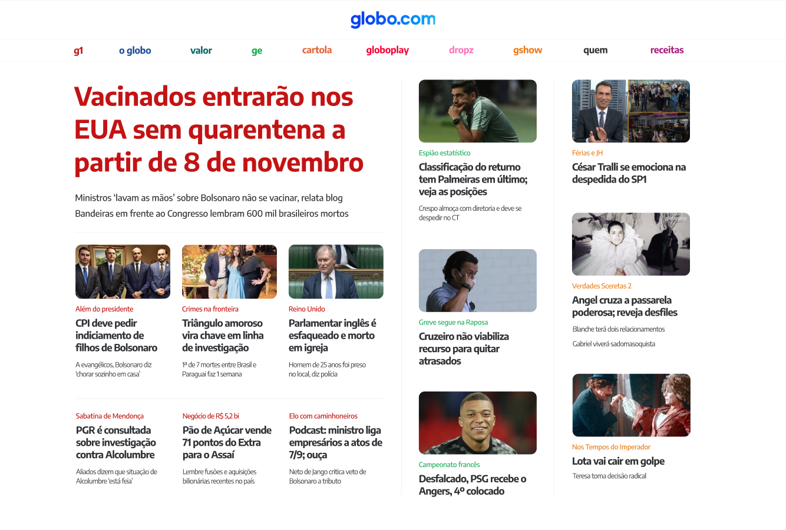

# Project 01 - Globo.com Homepage Clone

## Overview

This project is my first deep dive into web development, focusing on replicating the homepage of Globo.com. The goal was to apply HTML and CSS skills to create a simplified version of this popular website, emphasizing layout design and responsive features.

The task was not just about cloning the current homepage but following a specific design provided for educational purposes. This approach allowed me to focus on the foundational aspects of web design, such as layout structuring, font integration, and media queries, to ensure the page looks great across different devices.

## Key Features

- **Layout Implementation:** Followed a given design to closely replicate the homepage, paying attention to layout and positioning.
- **Custom Fonts:** Integrated the 'Encode Sans' font using Google Fonts, enhancing the page's visual appeal and readability.
- **Interactive News Links:** Made all news items clickable, directing to placeholder links, to simulate real-world application.
- **Styling Details:** Applied `border-radius` to images for a modern, rounded look.

## Challenges and Learning

Implementing this project helped me solidify my understanding of HTML and CSS. One particular challenge was ensuring that the page is responsive and looks good on mobile devices. By employing media queries, I was able to adapt the layout for smaller screens, learning a lot about responsive design principles in the process.

## Bonus: Mobile Responsiveness

After receiving feedback that the page was not fully optimized for mobile viewing, I took on the challenge to improve its responsiveness. Adjusting the layout to stack news items and modifying the navigation menu for mobile users were significant steps towards a more mobile-friendly design.

## Conclusion

This project was a great learning experience, allowing me to apply and expand my knowledge in web development. It was gratifying to see the webpage come together and function well across different devices. I look forward to building more complex and interactive websites in the future.

---

Feel free to explore the page and share any feedback!

